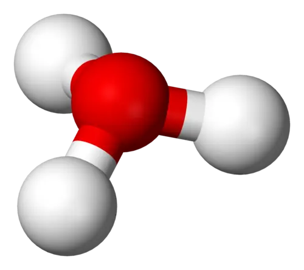
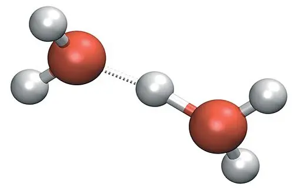
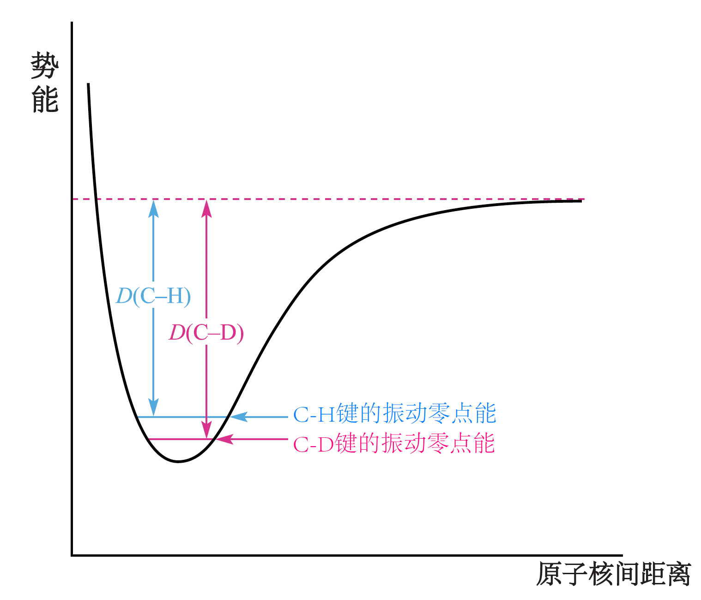

### Hydrogen 氢

#### 主题
- H+  和 H- 离子
- 氢的同位素
- 氢气
- 极性与非极性 E-H 键
- 氢键
- 二元氢化物

***
### 1.1 引言

氢 Hydrogen
- 原子序数 1
- 原子量 1.008
- 电子构型 1s1

氢是宇宙中最轻、含量最丰富的化学元素，约占所有普通物质的75% 

最简单的原子：1个质子 + 1个电子

***
### 1.2 离子 H+  和 H-

**H+ 离子（质子）**

氢原子的电离能是 1312 kJ·mol-1
很显然，质子不会存在于普通条件之下，因此，水中的 H+ 主要以 $[H_3O]^+$ 等形式存在

质子水合为强放热过程  
$\Delta _{hyd}H^o(H^+,g) = -1091kJ·mol^{-1}$

$[H_3O]^+$ 离子是一种确定的物种，在各种盐类中都具有其晶体学特征 (fig.1/2)

在结晶的酸水合物中也分离出了 $[H_5O_2]^+$ 离子和 $[H_9O_4]^+$ 离子 (fig. 3)

$[H_5O_2]$ 离子和 $[H_9O_4]^+$ 离子也是水合质子中的常见成员之一。水合质子即 $[H(OH_2)_n]^+ (n=1-20)$

**H- 离子**

氢原子的电子亲和能 $\Delta_{EA}H (298K)$ 是 $-73 kJ·mol^{-1}$

所有的碱金属氢化物均是 NaCl 型的晶体结构

根据衍射数据和金属离子的半径，H- 离子的半径是 154pm (LiH) 到 133pm (CsH), 平均值与133pm的 F- 相近

从H原子( $r_{共价}= 37 pm$ ) 到 H- 离子原子半径会大幅增加。其原因是因为 1s 电子对第二个电子进入 1s 原子轨道所产生的电子间排斥作用

LiH 中比较小的氢离子半径使得 Li-H 键在某种程度上具有共价键的性质。但是第1族金属氢化物的晶格能的计算值和实验值表明静电模型适用于每一种第一周期的金属氢化物

s区的金属 ( 除了Be ) 氢化物都可以通过 H2 和金属在加热条件下制备

离子氢化物倾向于分解成组成它的相应的元素。同时高价态的离子氢化物金属盐是最不可能存在的

（ 详见篇目2 ）

***

### 1.3 氢的同位素

**氘**

H 和 D 之间或 H2O 和 D2O 之间的差异来源于其质量的不同，而质量的不同反过来又会影响它们的基本振动波数和零点能（参见例题）

H2，HD 和 D2 的基本振动频率分别为 4159，3630 和 2990 cm-1，计算得出 H2 和 D2 的零点能分别为26.0 和 18.4 kJ·mol-1（见例题）

这些分子的总电子结合能相同 ，因此它们的解离能相差 $(26.0-18.4)=7.6kJ·mol^{-1}$

D-D 键强于 H-H 键

如 fig. 4 所展示的，R-D 键也强于相应 R-H 键，这种差异是动力学同位素效应的基础

**例题**

**第49届IChO**

>第2题：动力学同位素效应 ( KIE ) 与零点振动能 ( ZPE ) 

计算 ZPE 和 KIE  
动力学同位素效应 ( KIE ) 是指当反应物分子中一个原子被其同位素取代时而引起反应速率常数发生变化的一种效应。KIE 能用于确定反应中与氢相连的特定键的断裂。谐振模型常用来估算 C-H 和 C-D 键活化速率的差值。

谐振模型的振动频率 (ν) 可表示为：

$\nu = \frac{1}{2\pi} \sqrt{\frac{k}{\mu}}$

此处 k 为力常数， $\mu$ 为约化质量。

分子的振动能为：

$E_n = (n + \frac{1}{2})hν$ 

此处 n 为振动量子数，其取值为 0, 1, 2, 3, … 最低振动能级的能量 $E_n$ (n = 0) 称作零点振动能(ZPE)。

>2-A1) 计算 C-H ( $\mu_{CH}$ ) 和 C-D ( $\mu_{CD}$ ) 的约化质量，以原子质量单位表示，假设氘的质量为氢的2倍

>2-A2) 设 C-H 和 C-D 伸缩振动的力常数 (k) 相同，C-H 的伸缩振动频率为2900 $cm^{-1}$，计算
 C-D 伸缩振动频率 ( 单位为 $cm^{-1}$ )

>2-A3) 根据 2-A2) 中 C-H 和 C-D 的伸缩振动频率，计算 C-H 和 C-D 伸缩振动的零点能 ( ZPE )
(单位为 $kJ·mol^{-1}$ )

动力学同位素效应 ( KIE )  
由于零点振动能的差别，可以预料一个化合物与其相应的氘代物的反应速率会有差别。  
对于 C-H 和 C-D 的键断裂反应，它们的过渡态和产物能量分别都相同。那么，其同位素效应取决于 C-H 和 C-D 的 ZPE 的差别。

>2-A4) 计算 C-H 和 C-D 键的键解离能 ( BDE ) 差值 ( BDECD - BDECH )，单位为 $kJ·mol^{-1}$

>2-A5) 设 C-H / C-D 键断裂的活化能 ($E_a$) 近似于其键能，C-H 和 C-D 键断裂的 Arrhenius 指前因子相同，计算在 25 °C下 C-H / C-D 键断裂反应的速率常数比值 ( $k_{CH}$ / $k_{CD}$ )

